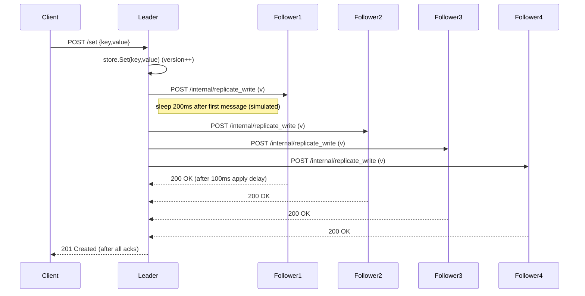
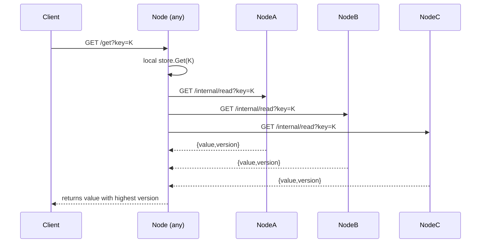
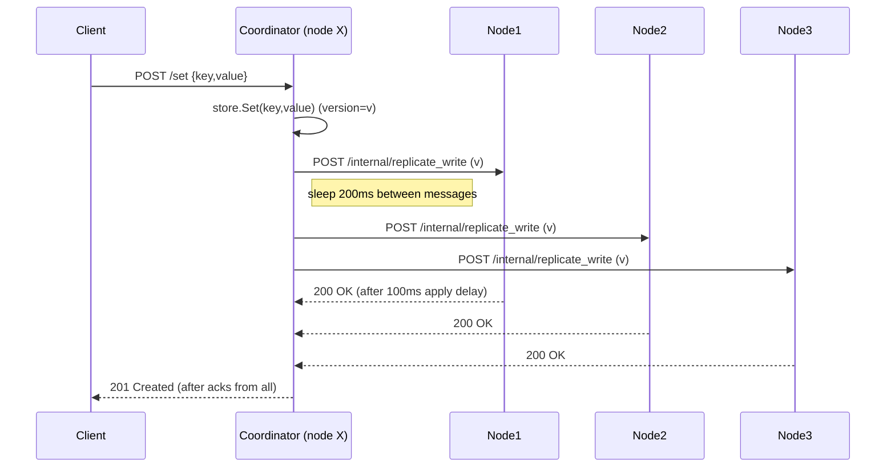

# KV Store Implementation & Workflows

This document explains how the in-memory Key-Value (KV) store in this project works, and walks through the read/write workflows for the Leader‑Follower and Leaderless implementations. It also points to the source files where each behavior is implemented and how to change key parameters (delays, R/W values).

Files to inspect
- Core store: `internal/kvstore/store.go`
- Leader‑Follower: `internal/leaderfollower/*` and entry `cmd/leader-follower/main.go`
  - handlers: `internal/leaderfollower/handlers.go`
  - replication logic: `internal/leaderfollower/replication.go`
  - RPC client: `internal/leaderfollower/client.go`
  - config: `internal/leaderfollower/node.go`
- Leaderless: `internal/leaderless/*` and entry `cmd/kv-service/main.go` (or dedicated leaderless binary if present)
  - handlers: `internal/leaderless/handlers.go`
  - replication manager: `internal/leaderless/replication.go`
  - RPC client: `internal/leaderless/client.go`
  - config: `internal/leaderless/node.go`

## What "KV store" means here
- Simple in-memory map keyed by string. Each value carries a logical version (int64). The store is non-persistent.
- Key types and operations (see `internal/kvstore/store.go`):
  - `Set(key, value)` — increments the node's global version counter and stores the value with that version (used by the local writer or leader/coordinator).
  - `SetWithVersion(key, value, version)` — set value using a provided version (used during replication to apply remote updates).
  - `Get(key)` / `LocalRead(key)` — read local copy (returns a copy to avoid races).

Versions are monotonic per node and used to choose the most recent value when reading from multiple nodes.

## Global timing knobs (where delays are implemented)
- Leader/coordinator extra delay between outgoing replication messages: implemented in `ReplicationClient.ReplicateWrite` (both leaderless and leader‑follower clients). The code sleeps 200ms when `addDelay` is true.
- Follower delay on applying replication: implemented in `ReplicateWriteHandler` (both `internal/leaderfollower/handlers.go` and `internal/leaderless/handlers.go`) — follower sleeps 100ms before applying the replication.
- Follower delay on reads initiated by leader: implemented in `internal/leaderfollower/handlers.go` `InternalReadHandler` where followers sleep 50ms before responding to internal read requests.

You can edit these hard-coded sleeps to tune the inconsistency window for tests.

---

## Leader‑Follower workflows

Overview
- One node is configured as the Leader; other nodes are Followers. All client writes must be sent to the Leader. Reads may go to any node.
- Replication parameters R and W are configurable (via the `/config` endpoint implemented in `internal/leaderfollower/handlers.go`). The `ReplicationManager` in `internal/leaderfollower/replication.go` implements behaviors for different R/W settings.

Leader‑Follower: Write (general)
1. Client sends `POST /set` to the Leader.
2. Leader calls `store.Set(key,value)` to create a new version locally.
3. Leader sends replication requests to Followers (`POST /internal/replicate_write`) using `ReplicationClient.ReplicateWrite`.
   - Leader sleeps 200ms between sending messages (to widen window) — see client `addDelay` usage.
   - Each Follower sleeps 100ms on receiving replication before applying the update (in `ReplicateWriteHandler`).
4. Leader waits for the required number of acknowledgements depending on W:
   - W=5: wait for all followers (strict write-all) — `WriteStrategyW5R1`.
   - W=1: return immediately after local write and replicate asynchronously — `WriteStrategyW1R5`.
   - W=3: wait until W nodes (including leader) ack — `WriteStrategyW3R3`.
5. When quorum is satisfied, Leader responds `201 Created` to the client.

Leader‑Follower: Read (general)
- Reads use the R parameter to determine coordination:
  - R=1: `ReadStrategyR1` returns the local store value immediately (fast, may be stale on followers).
  - R=5: `ReadStrategyR5` concurrently queries all nodes (local + remote) and returns the value with the highest version.
  - R=3: `ReadStrategyR3` queries nodes and returns most recent among the first R successful responses (quorum).

Mermaid flow: Leader‑Follower write (W=5 example)

Mermaid flow: Leader‑Follower read (R=5 example)

Implementation notes
- Read-from-remote calls go through `ReplicationClient.ReadFromNode` which triggers a follower 50ms sleep on internal read requests.
- The function `getMostRecentValue` in `replication.go` selects the KeyValue with the highest `Version`.

---

## Leaderless workflows

Overview
- No single leader. Any node can accept writes. When a node receives a write it becomes the Write Coordinator for that request and must coordinate replication to all other nodes. The code configures R=1 and W=N for leaderless mode by design (see `internal/leaderless/node.go`).

Leaderless: Write (W=N)
1. Client sends `POST /set` to any node (the coordinator).
2. Coordinator calls `store.Set(key,value)` locally to produce a version.
3. Coordinator sends replication requests to all other nodes (`POST /internal/replicate_write`) using `ReplicationClient.ReplicateWrite`.
   - The coordinator sleeps 200ms between sending messages (to widen window) — implemented in the replication client.
   - Each receiving node sleeps 100ms before applying the update and responds.
4. Coordinator waits for responses from all nodes (W = N). If all succeed, coordinator responds `201 Created` to the client; otherwise the write fails.

Leaderless: Read (R=1)
- Client GET returns the local store value immediately (no coordination). This makes stale reads possible if the node has not been updated yet by a concurrent write coordinator.

Mermaid flow: Leaderless write (W=N)

Why stale reads may or may not appear
- In our measurement environment (local machine), most runs reported `stale_reads = 0`. That is because replication typically completed before reads arrived. To produce stale reads reliably, increase concurrency, shorten the coordinator/leader waiting behavior (e.g., W=1), or increase follower apply delays / simulate network latency.

---

## Quick pointers for experiments and debugging
- Toggle R/W values for the Leader‑Follower mode by POSTing to `/config` on any node (see `internal/leaderfollower/handlers.go`).
- Adjust delays by editing the sleep durations in the following locations and re-building:
  - Leader/coordinator inter-message delay: `internal/leaderfollower/client.go` and `internal/leaderless/client.go` (`time.Sleep(200 * time.Millisecond)`).
  - Follower replication apply delay: `internal/leaderfollower/handlers.go` and `internal/leaderless/handlers.go` (`time.Sleep(100 * time.Millisecond)`).
  - Follower internal read delay (leader reads): `internal/leaderfollower/handlers.go` (`time.Sleep(50 * time.Millisecond)`).
- Use the test endpoint `/local_read?key=K` on followers to inspect local state during replication windows.

## Where tests and results live
- Load tests, raw data, and graphs are saved under the repository `results/` directory. Example: `results/lf_w5_r1_01_99/summary.json` contains per-run aggregates (latency percentiles, stale read counts).

---

If you want, I can also:
- Add PNG flowcharts generated from these mermaid diagrams and place them in `docs/` (requires running a mermaid renderer), or
- Add a short README section with exact commands to re-run a selected scenario (docker-compose or run scripts).

End of document.
